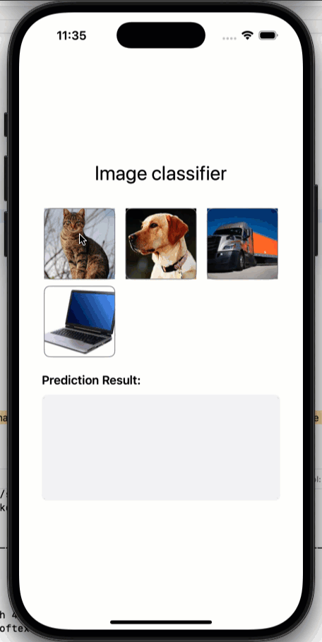
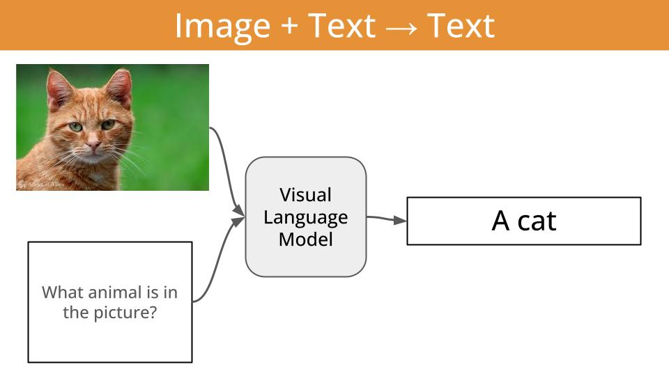
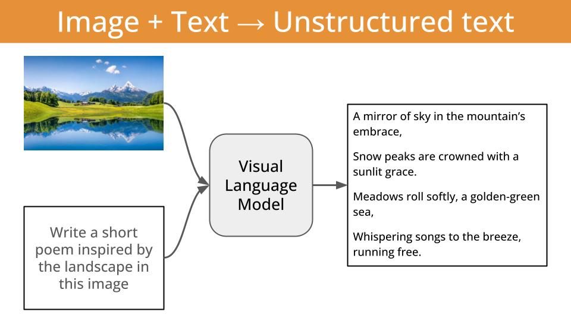
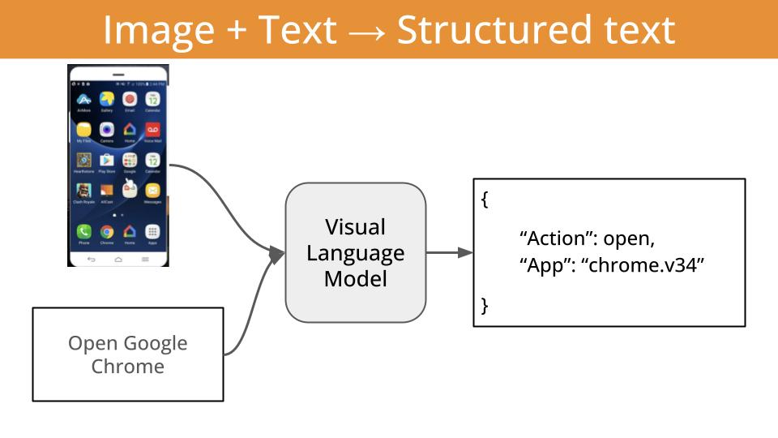
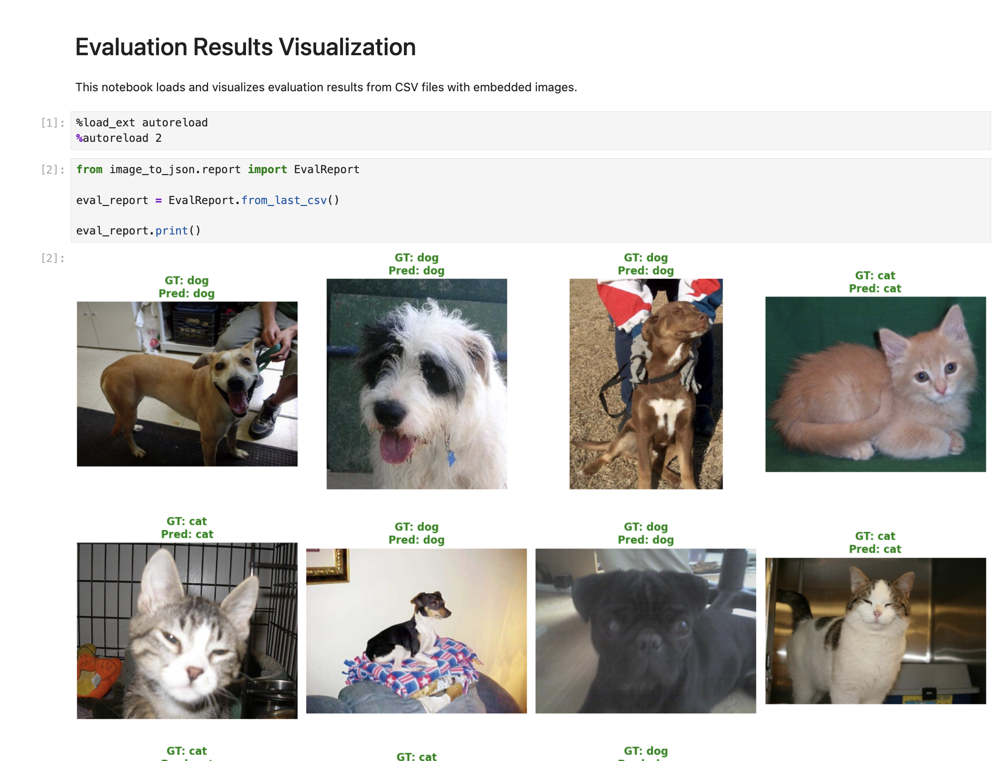
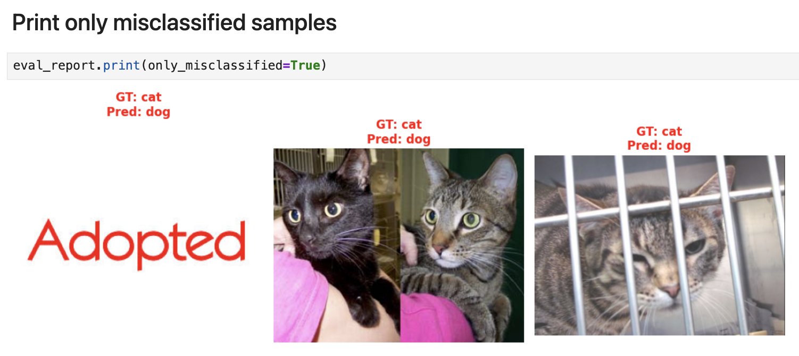
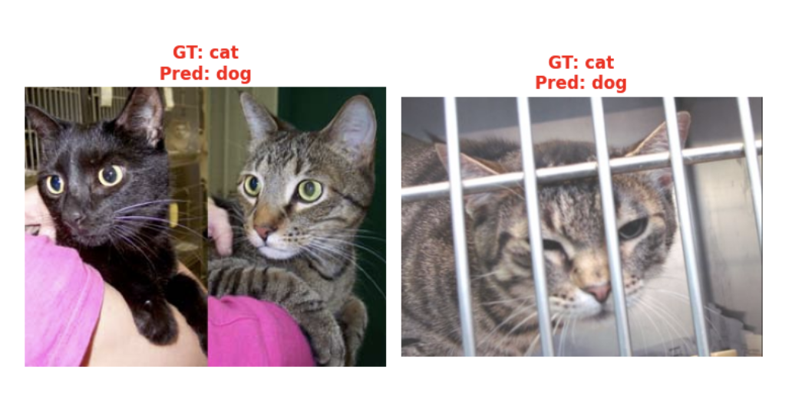
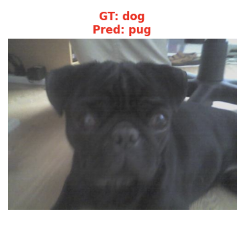

<div align="center">

# Super fast and accurate image classification on edge devices
## *Local Visual Language Models for Edge AI*
</div>

<div align="center">

</div>

<div align="center">

</div>

### Table of contents

- [What is this repo about?](#what-is-this-repo-about)
- [What is a Visual Language Model?](#what-is-a-visual-language-model)
- [Why image classification?](#why-image-classification)
- [Task 1 -> Cats vs Dogs classification (easy)](#task-1---cats-vs-dogs-classification-easy)
  - [Step 1. Build a model-and-dataset-agnostic evaluation pipeline](#step-1-build-a-model-and-dataset-agnostic-evaluation-pipeline)
  - [Step 2. Getting a baseline accuracy](#step-2-getting-a-baseline-accuracy)
  - [Step 3. Visualizing the eval results](#step-3-visualizing-the-eval-results)
  - [Step 4. What if I try a larger model?](#step-4-what-if-i-try-a-larger-model)
  - [Step 5. Structured Generation to the rescue](#step-5-structured-generation-to-the-rescue)
- [Task 2 -> Human Action Recognition classifier (medium) (COMING SOON)]()
- [Task 3 -> Car brand, model and year identification classifier (hard) (COMING SOON)]()
- [Deploy the classifier into an iOS app (COMING SOON)]()
- [Want to learn more Real World LLM engineering?](#want-to-learn-more-real-world-llm-engineering)


## What is this repo about?

In this repository you will learn how to build and deploy high-accuracy-and-low-latency image classifers into your phone using local Visual Language Models.

We will use

- a sequence of increasingly complex classification tasks, to uncover step-by-step how to build highly-specialized image classification systems, tailored to your specific use case.

- the [**LFM2-VL** family of open-weight Visual Language Models (aka VLMs) by Liquid AI](https://huggingface.co/collections/LiquidAI/lfm2-vl-68963bbc84a610f7638d5ffa) to classify images for these tasks.

- the [**LeapSDK**](https://leap.liquid.ai/docs) for iOS to deploy the final models into an iOS app.


Each of the tasks will be progressively more complex, and will require us to build a more specialized image classifier.

The final artifact (aka the model) will be bundled as an artifact that you can embed into your iOS app (and soon Android) build, and invoke as any other async function.

For example, a cat vs dog classifier in Swift looks like this:

```swift
enum AnimalClassification: String, CaseIterable {
    case dog = "dog"
    case cat = "cat"
}

func classify(image: UIImage) async -> AnimalClassification {
    // TODO: Add actual classification logic here
    // For now, return a random classification
    return AnimalClassification.allCases.randomElement() ?? .dog
}
```

## What is a Visual Language Model?

A visual language model (aka VLM) is just a function that given

- an image, and
- a piece of text (aka the prompt)

outputs

- another piece of text.

In other words, a VLM is a function that can transform visual information (e.g. images or videos) into textual information.



And the thing is, this textual output can be either

- **unstructured** and beautiful English/Chinese/Spanish/or-whatever-other-language-you-like

  

or (even better)

- **structured** output, like tool calls, that can guide killer apps like local agentic workflows.

  


Text + Image to Structured Text is IMHO the most impactful application of VLMs, as it unlocks lightweight, cost-effective and offline-first agentic workflows on edge devices, meaning phones, drones, smart homes, etc.

I plan to cover local agentic workflows in a future repository.

In this repository we will focus on a slightly easier task: image classification.


## Why image classification?

Image classification is a fundamental task in computer vision, that has tons of real-word applications, especially when deployed on edge devices that do not require internet access. For example:

- **Self-driving cars** use edge-deployed models to classify pedestrians, vehicles, traffic signs, and road obstacles in real-time without relying on cloud connectivity for critical safety decisions.

- **Factory production lines** employ edge vision systems to classify defective products, missing components, or assembly errors, enabling immediate rejection of faulty items.

- **Medical diagnostic imaging** to classify skin lesions, detect fractures, or identify abnormalities, providing immediate diagnostic support without sharing confidential patient data.

- **Smart security cameras** classify potential threats, recognize authorized personnel, and detect suspicious activities locally without sending video data to external servers.
 

## Task 1 -> Cats vs Dogs classification (easy)

### Step 1. Build a model-and-dataset-agnostic evaluation pipeline

Asking a visual Language Model to classify an image either as a dog or a cat looks like a boring (even useless) task. I agree.

However, as you will see in this section, even an "easy" task like this one requires some care and love if you want to get production-grade results.

<div style="border: 2px solid #000000; border-radius: 8px; padding: 16px; margin: 16px 0; background-color: #f9f9f9;">
  <strong>What are production-grade results?</strong>
  <br>
  Production-grade means the model performance is good enough to be used in your production environment. The exact number depends on your use case.

  For example
  
  - Building a cats vs dogs classifier demo that is accurate 98% of the time is probably enough to impress your boss, and get the buy in you need to move forward with a new educational app.
  
  - Building a pedestrian vs sign classifier that is accurate 98% of the time is not enough for a self-driving car application..
  
  </div>
  
If you open the `image-to-json` directory, you will find 3 subdirctories, that correspond to the inputs, bussiness logic and output of the evaluation process:

- `configs/`. YAML files that contain the evaluation parameters, including the VLM to use, the dataset to evaluate on, and the prompt to use.

- `image-to-json/`. The Python code to evaluate (and soon fine-tune) a given VLM on a given dataset.
    - Evaluation code is in the `evaluate.py` file, and uses Modal to run on GPU accelerated hardware.

- `evals/`. The evaluation reports generated by the `evaluate.py` script. You can inspect them using the jupyter notebook `notebooks/visualize_evals.ipynb`.


### Step 2. Getting a baseline accuracy

<div style="border: 2px solid #000000; border-radius: 8px; padding: 16px; margin: 16px 0; background-color: #f9f9f9;">
<strong>Python environment setup 🔨🐍</strong>
<br>
To follow along you will need to:

1. Install `uv` as explained [here](https://docs.astral.sh/uv/getting-started/installation/#__tabbed_1_1).

2. Run `uv sync` to install all Python dependencies.
</div>

Let's start by getting a baseline accuracy with a nano model, the LFM2-VL-450M.

This model is a 450M parameter model, and it is a good starting point for most image classification tasks.

The config file we will use is the `configs/cats_vs_dogs_v0.yaml` file.

```yaml
# To ensure deterministic runs
seed: 23

# Model parameters
model: "LiquidAI/LFM2-VL-450M"
structured_generation: false

# Dataset parameters
dataset: "microsoft/cats_vs_dogs"
n_samples: 100
split: train
image_column: "image"
label_column: "labels"
label_mapping:
  0: "cat"
  1: "dog"

# Prompt parameters
system_prompt: |
  You are a veterinarian specialized in analyzing pictures of cats and dogs
  You excel at identifying the type of animal from a picture.

user_prompt: |
  What animal in the following list is the one you see in the picture?

  - cat
  - dog

  Provide your answer as a single animal from the list without any additional text.

```

To run an evaluation using this configuration do:

```sh
uv run modal run -m src.image_to_json.evaluate --config-file-name cats_vs_dogs_v0.yaml
```

Two things to note here:

- The `modal run` command is used to run the evaluation function on Modal, so you get GPU acceleration. I don't have an NVIDIA GPU at home (and you probably don't either), so with Modal you can get it and pay only for the compute you use.

- I am not a big fan of long bash command, so I created a Makefile to make it easier to run the evaluation. If you have `make` installed, you can run the evaluation with the following command:

  ```sh
  make evaluate CONFIG_FILE=cats_vs_dogs_v0.yaml
  ```

If you haven't changed any of the parameters (including the `seed`) you should see the following output:

```sh
Accuracy: 0.97
✅ Evaluation completed successfully
```

Not bad, but still... distinguishing between cats and dogs is not that hard.

Where is the model failing?

### Step 3. Visualizing the eval results

The `evaluation.py` script generates a CSV file with the
- images encoded in base64,
- predictions and
- the ground truth labels

that is saved in the `evals/` directory.

To visualize it, I created the jupyter notebook `notebooks/visualize_evals.ipynb`. You can open it by running the following command:

```sh
uv run jupyter notebook notebooks/visualize_evals.ipynb
```

The output shows each of the images in the evaluation run (100 in this case), and the ground truth and predicted labels on the top of each image.

Green denotes correct predictions, red denotes incorrect predictions.



To visualize the 3 misclassified samples, you can run the following cell:

```python
eval_report.print(only_misclassified=True)
```



The first sample is not a model failure, but a dataset failure. The second and third are model failures.

<div style="border: 2px solid #000000; border-radius: 8px; padding: 16px; margin: 16px 0; background-color: #f9f9f9;">
<strong>Tip 💡</strong>
<br>
I highly recommend you do this kind of sample-by-sample analysis when you are trying to understand why a model is not performing well. It ofen reveals problems you were not aware of, like finding the "Adopted" text from above in our cats vs dogs dataset.
</div>

At this point, you have 2 options:

- **Option 1**:  You remove the first misclassified sample from the dataset (the one with the word "Adopted") as it does not belong neither to the "cat" or "dog" classes.


- **Option 2**: Keep the misclassified sample and add a new class to your classification problem, like "other". In this case, your model is a 3-class classifier that can output either "cat", "dog" or "other".

Option 2 will produce a more robust model, that won't produce non-sense responses when the picture shown to it has nothing to do with a cat or a dog.

However, as I am bit short on time today, I will stick to Option 1, and just drop the first misclassified sample from the dataset.

Now...

### What about the second and third misclassified samples?



At this point, there are at least 3 ways to proceed:

- **Option 1**: Use a more powerful VLM.
  - For example, instead of using LFM2-VL-450M, you can use LFM2-VL-1.6B.
  
  This is a valid option if the device where you will deploy the model is powerful enough to handle the larger model. Otherwise, you will need to try options 2 or 3.

- **Option 2**: Improve your prompt.
  - For example, you can try a prompt that can handle situations in which there are 2 cats instead of 1, which is an edge case that fools our current model.

  There are also automatic ways to optimize prompts, using a library like DSPy and a technique like MIPROv2. [Check this tutorial for an example](https://huggingface.co/blog/dleemiller/auto-prompt-opt-dspy-cross-encoders#dspy-optimization).

- **Option 3**: Fine-tune the model. This is a more computationally expensive option, as it involves both a forward and a backward pass through the model, but tends to give the best results. This is the option we will use for the Human Recognition, and Card bran/model/year detection tasks.

For the time being, let's see if LFM2-VL-1.6B can handle the second and third misclassified samples.

### Step 4. What if I try a larger model?

From the command line, run:
```sh
make evaluate CONFIG_FILE=cats_vs_dogs_v1.yaml
```
and you will get the following output:

```sh
Accuracy: 0.99
✅ Evaluation completed successfully
```

Which means that now only 1 out of the 100 samples is misclassified.

If you re-run the notebook, you will see the model just came up with a new label: "pug".



And the thing is, the LM is probably right when it says this particular dog corresponds to the "pug" breed. But this is not what we asked for.


> [!NOTE]
> **What's going on here?**
> 
> LMs are not logic machines. They are just next-token predictors.
> 
> LMs generate text based on probability distributions, not strict logic. Even when you specify "choose A or B," the model might generate C if those tokens seem plausible in context.

The question is: how can we "force" the model to output a specific format?

And this is where "Structured Generation" comes to the rescue.

### Step 5. Structured Generation to the rescue

TODO


## Want to learn more about building and deploying real-world AI systems?

Subscribe for FREE to [my newsletter](https://paulabartabajo.substack.com/) to receive weekly tutorials on how to build and deploy real-world AI systems.

[👉 Subscribe here](https://paulabartabajo.substack.com/)