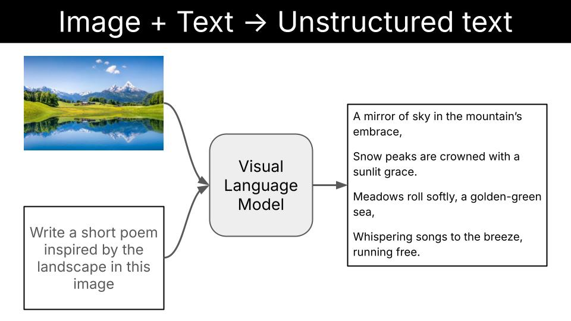
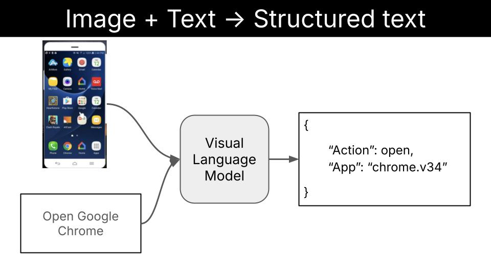

<div align="center">

# Super fast and accurate image classification on edge devices
## *Local Visual Language Models for Edge AI*
</div>

<div align="center">

</div>

### Table of contents

- [What is this repo about?](#what-is-this-repo-about)
- [What is a Visual Language Model?](#what-is-a-visual-language-model)
- [Why image classification?](#why-image-classification)
- [Task 1. Cats vs Dogs classification (easy)](#task-1-cats-vs-dogs-classification-easy)
  - [Step 1. Build the evaluation pipeline](#step-1-build-the-evaluation-pipeline)
  - [Step 2. Getting a baseline accuracy](#step-2-getting-a-baseline-accuracy)
  - [Step 3. Visualizing the eval results](#step-3-visualizing-the-eval-results)
  - [Step 4. Let's try a larger model](#step-4-lets-try-a-larger-model)
  - [Step 5. Structured Generation to the rescue](#step-5-structured-generation-to-the-rescue)
  - [Step 6. Supervised fine-tuning to squeeze all the juice](#step-6-supervised-fine-tuning-to-squeeze-all-the-juice)
- [Task 2 -> Car brand, model and year identification classifier (hard) (COMING SOON)]()
- [Task 3 -> Human Action Recognition classifier (medium) (COMING SOON)]()
- [Deploy the classifier into an iOS app (COMING SOON)]()
- [Want to learn more Real World LLM engineering?](#want-to-learn-more-real-world-llm-engineering)


## What is this repo about?

In this repository you will learn how to build and deploy high-accuracy-and-low-latency image classifers into your phone using local Visual Language Models.

We will use

- a sequence of increasingly complex classification tasks, to uncover step-by-step how to build highly-specialized image classification systems, tailored to your specific use case.

- the [**LFM2-VL** family of open-weight Visual Language Models (aka VLMs) by Liquid AI](https://huggingface.co/collections/LiquidAI/lfm2-vl-68963bbc84a610f7638d5ffa) to classify images for these tasks.

- the [**Leap Edge SDK**](https://leap.liquid.ai/docs) for iOS to deploy the final models into an iOS app.


Each of the tasks will be progressively more complex, and will require us to build a more specialized image classifier.

We will bundle the final model into a very simple iOS app, and we will invoke it using the Leap Edge SDK and regular async functions.

For example, a cat vs dog classifier in Swift looks like this:

```swift
enum AnimalClassification: String, CaseIterable {
    case dog = "dog"
    case cat = "cat"
}

func classify(image: UIImage) async -> AnimalClassification {
    // TODO: Add actual classification logic here
    // For now, return a random classification
    return AnimalClassification.allCases.randomElement() ?? .dog
}
```

## What is a Visual Language Model?

A visual language model (aka VLM) is just a function that given

- an image, and
- a piece of text (aka the prompt)

outputs

- another piece of text.

In other words, a VLM is a function that can transform visual information (e.g. images or videos) into textual information.


This textual output can be either

- **unstructured**, like a beautiful poem in English/Chinese/Spanish/or-whatever-other-language-you-like

  

or (even better if you ask me)

- **structured** output, like tool calls, that can guide killer apps like local multi-modal agentic workflows.

  


> [!NOTE]
>
> **Text + Image to Structured Text is IMHO the most impactful application of VLMs**, as it unlocks local multi-modal agentic workflows on cell phones, regular laptops, robots, drones, smart homes, etc.
>
> I plan to cover local multi-modal agentic workflows in a future repository.
>
> In this repository we will focus on a slightly easier task: image classification.


## Why image classification?

Image classification is a fundamental task in computer vision, that has tons of real-word applications, especially when deployed on edge devices that do not require internet access. For example:

- **Self-driving cars** use edge-deployed models to classify pedestrians, vehicles, traffic signs, and road obstacles in real-time without relying on cloud connectivity for critical safety decisions.

- **Factory production lines** employ edge vision systems to classify defective products, missing components, or assembly errors, enabling immediate rejection of faulty items.

- **Medical diagnostic imaging** to classify skin lesions, detect fractures, or identify abnormalities, providing immediate diagnostic support without sharing confidential patient data.

- **Smart security cameras** classify potential threats, recognize authorized personnel, and detect suspicious activities locally without sending video data to external servers.
 

## Task 1. Cats vs Dogs classification (easy)

Asking a visual Language Model to classify an image either as a dog or a cat looks like a boring (even useless) task. I agree.

However, as you will see in this section, even an "easy" task like this one requires some care and love if you want to get production-grade results.

> [!NOTE]
> **What are production-grade results?**
> 
> Production-grade means the model performance is good enough to be used in your production environment. The exact number depends on your use case.
> 
> For example
> 
> - Building a cats vs dogs classifier demo that is accurate 98% of the time is probably enough to impress your boss, and get the buy in you need to move forward with a new educational app.
> 
> - Building a pedestrian vs sign classifier that is accurate 98% of the time is not enough for a self-driving car application..

### Step 1. Build the evaluation pipeline

The evaluation pipeline is a program that takes as input

- a dataset `D`
- a model `M`, and
- a bunch of other parameters `Ps` (e.g. the prompt, the model output schema, etc)

and outpus a float number `E` (aka the evaluation metric) that measures how good does the combination of `M` and `Ps` perform on the dataset `D`.


The higher the `E` the better it is.

For classification tasks with balanced classes, the evaluation metric is typically the accuracy, measured as the ratio of the number of correct predictions to the total number of predictions.

The implementation of our `evaluate.py` script is generic enough to be used for any text + image -> label prediction task with balanced classes.

> [!NOTE]
> **What happens when your dataset has unbalanced classes?**
>
> For example, imagine you work at a self-driving car company, and you are trying to build a classifier that can detect dangerous situations on the road. The system can be used to detect dangerous situations like pedestrians crossing the road, animals in the road, and take action to avoid them.
>
> If you generate your evaluation dataset by randomly sampling frames from the videos generated by your fleet of test cars, you will end up with a dataset where more than 99% of the video frames correspond to the "no danger" class. In this case, you should not optimize for overall accuracy, but for high recall on the "danger" class.


If you open the `image-to-json` directory, you will find 3 subdirectories, that correspond to the inputs, bussiness logic and output of the evaluation process:

- `configs/`. YAML files that contain the evaluation parameters, including the VLM to use, the dataset to evaluate on, and the prompt to use.

- `image-to-json/`. The Python code to evaluate (and soon fine-tune) a given VLM on a given dataset.
    - Evaluation code is in the `evaluate.py` file, and uses Modal to run on GPU accelerated hardware.

- `evals/`. The evaluation reports generated by the `evaluate.py` script. You can inspect them using the jupyter notebook `notebooks/visualize_evals.ipynb`.


### Step 2. Getting a baseline accuracy

> [!NOTE]
> **Python environment setup 🔨🐍**
> 
> To follow along you will need to:
> 
> 1. Install `uv` as explained [here](https://docs.astral.sh/uv/getting-started/installation/#__tabbed_1_1).
> 
> 2. Run `uv sync` to install all Python dependencies.

Let's start by getting a baseline accuracy with a nano model, the [LFM2-VL-450M](https://huggingface.co/LiquidAI/LFM2-VL-450M).

The config file we will use is the `configs/cats_vs_dogs_v0.yaml` file.

```yaml
# To ensure deterministic runs
seed: 23

# Model parameters
model: "LiquidAI/LFM2-VL-450M"
structured_generation: false

# Dataset parameters
dataset: "microsoft/cats_vs_dogs"
n_samples: 100
split: train
image_column: "image"
label_column: "labels"
label_mapping:
  0: "cat"
  1: "dog"

# Prompt parameters
system_prompt: |
  You are a veterinarian specialized in analyzing pictures of cats and dogs
  You excel at identifying the type of animal from a picture.

user_prompt: |
  What animal in the following list is the one you see in the picture?

  - cat
  - dog

  Provide your answer as a single animal from the list without any additional text.

```

To run an evaluation using this configuration do:

```sh
uv run modal run -m src.image_to_json.evaluate --config-file-name cats_vs_dogs_v0.yaml
```

Two things to note here:

- The `modal run` command is used to run the evaluation function on Modal, so you get GPU acceleration. I don't have an NVIDIA GPU at home (and you probably don't either), so with Modal you can get it and pay only for the compute you use.

- I am not a big fan of long bash command, so I created a Makefile to make this comand more readable. If you have `make` installed, you can run the evaluation as follows:

  ```sh
  make evaluate CONFIG_FILE=cats_vs_dogs_v0.yaml
  ```

If you haven't changed any of the parameters (including the `seed`) you should see the following output:

```sh
Accuracy: 0.97
✅ Evaluation completed successfully
```

Not bad, but still... distinguishing between cats and dogs is not that hard.

Where is the model failing?

### Step 3. Visualizing the eval results

Apart from the accuracy score, the `evaluation.py` script generates a CSV file with the
- images encoded in base64,
- predictions and
- the ground truth labels

that is saved in the `evals/` directory. This sample-by-sample is super useful to understand where the model is failing.

To visualize this data I created the jupyter notebook `notebooks/visualize_evals.ipynb`. You can open it by running the following command:

```sh
uv run jupyter notebook notebooks/visualize_evals.ipynb
```

The output shows each of the images in the evaluation run (100 in this case), and the ground truth and predicted labels on the top of each image.

Green denotes correct predictions, red denotes incorrect predictions.


To visualize the 3 misclassified samples, you can run the following cell:

```python
eval_report.print(only_misclassified=True)
```


The first sample is not a model failure, but a dataset failure. The second and third are model failures.

> [!TIP]
> 
> I highly recommend you do this kind of sample-by-sample analysis when you are trying to understand why a model is not performing well. It ofen reveals problems you were not aware of, like finding the "Adopted" text from above in our cats vs dogs dataset.

At this point, you have 2 options:

- **Option 1**:  You remove the first misclassified sample from the dataset (the one with the word "Adopted") as it does not belong neither to the "cat" or "dog" classes.

- **Option 2**: Keep the misclassified sample and add a new class to your classification problem, like "other". In this case, your model is a 3-class classifier that can output either "cat", "dog" or "other".

Option 2 will produce a more robust model, that won't produce non-sense responses when the picture shown to it has nothing to do with a cat or a dog.

However, as I am bit short on time today, I will stick to Option 1, and just drop the first misclassified sample from the dataset.

Now...

### What about the second and third misclassified samples?


At this point, there are at least 3 ways to proceed:

- **Option 1**: Use a more powerful VLM. For example, instead of using LFM2-VL-450M, you can use LFM2-VL-1.6B.
  
  This is a valid option if the device where you will deploy the model is powerful enough to handle the larger model. Otherwise, you will need to try options 2 or 3.

- **Option 2**: Improve your prompt. For example, you can try a prompt that can handle situations in which there are 2 cats instead of 1, which is an edge case that fools our current model.

  There are also automatic ways to optimize prompts, using a library like DSPy and a technique like MIPROv2. [Check this tutorial for an example](https://huggingface.co/blog/dleemiller/auto-prompt-opt-dspy-cross-encoders#dspy-optimization).

- **Option 3**: Fine-tune the model. This is a more computationally expensive option, as it involves both a forward and a backward pass through the model, but tends to give the best results. This is the option we will use for the Human Recognition, and Card bran/model/year detection tasks.

For the time being, let's see if LFM2-VL-1.6B can handle the second and third misclassified samples.

### Step 4. Let's try a larger model

From the command line, run:
```sh
make evaluate CONFIG_FILE=cats_vs_dogs_v1.yaml
```
and you will get the following output:

```sh
Accuracy: 0.99
✅ Evaluation completed successfully
```

Which means that now only 1 out of the 100 samples is misclassified.

If you re-run the notebook, you will see the model just came up with a new label: "pug".


And the thing is, the LM is probably right when it says this particular dog corresponds to the "pug" breed. But this is not what we asked for.


> [!NOTE]
> **What's going on here?**
> 
> LMs are not logic machines. They are just next-token predictors.
> 
> LMs generate text based on probability distributions, not strict logic. Even when you specify "choose A or B," the model might generate C if those tokens seem plausible in context.

So the question is

> How can we "force" the model to output a specific format?

..and this is where structured generation comes to the rescue.

### Step 5. Structured Generation to the rescue

Structured generation is a technique that allows us to "force" the Language Model to output a specific format, like JSON.

Remember, Language Models generate text by sampling one token at a time. At each step of the decoding process, the model generates a probablity distribution over the next token and samples one token from it.

Structured generation techniques "intervene" at each step of the decoding process, by masking tokens that are not compatible with the structured output we want to generate.

For example, in our case we want the model to output either this

```json
{"pred_class": "dog"}
```
or this
```json
{"pred_class": "cat"}
```

If we use structured generation library on top of our LM, we will force the decoding process to be

- Deterministic up to the 5th token.
- Non-deterministic at token 6, where the model needs to choose between "dog" and "cat".
- Deterministic at token 7, where the model is forced to output the "}" token.


Ok, enough talking. Let's try it out.

You can find the implementation of the `get_structured_model_output` function in `inference.py`, that uses the [Outlines](https://github.com/outlines-ai/outlines) library.

To see it in action, run an evaluation loop using the `configs/cats_vs_dogs_v2.yaml` file, where the `structured_generation` parameter is set to `true`.

```sh
make evaluate CONFIG_FILE=cats_vs_dogs_v2.yaml
```

The output should look like this:

```sh
Accuracy: 0.98
✅ Evaluation completed successfully
```

Which is both good news and bad news.

The good news is that the model does not hallucinate "pug" labels anymore.

The bad news is that the model is still making mistakes.

If you re-run the notebook you will find the 2 misclassified examples.


At this point, we have a model that is accurate 98% of the time, and it does not hallucinate labels anymore.

But you know what, I think we should do better than this.

Let's fine tune the model to squeeze all the juice out of it.

### Step 6. Supervised fine-tuning to squeeze all the juice

In this section I will show you how to fine-tune LFM2-VL-450M to achieve 100% accuracy on the cats vs dogs classification task.

But before we start...

#### What is fine-tuning?

Fine-tuning is all about adjusting the model's parameters to improve its performance on a specific task. Yes, fine tuning is just a fancy name for "training" which is something ML scientists and engineers have done for decades.

#### What is the problem?

10 years ago there were almost no models with more than 100M parameters.

Nowadays, Language Models typically have billions of parameters, so it
is not feasible to adjust all the parameter of the model. You either 

- do not have enough memory to load the network parameters (plus gradients you need for your backward pass)
- or, even if you load it, the forward and backward pass are so slow that you can't train the model in a reasonable time.

To solve this problem, crazy scientists invented a technique called LoRA, which stands for Low-Rank Adaptation.

#### What is LoRA?

Instead of modifying the billions of parameters in your model, LoRA freezes the original weights and adds small "adapter" layers that learn the task-specific adjustments.


This trick works because the updates needed during fine-tuning typically have low "intrinsic rank", meaning they can be represented with far fewer parameters than you'd expect.

Ok, enough talking. Let's move to the implementation.

#### 1. Split the dataset into train and eval sets

We cannot evaluate our fine-tuned model on the same samples we use for fine-tuning, as it would be cheating.

Therefore, I created a script to split the dataset into train and eval sets. We will use the train split to fine-tune the model, and the eval split to evaluate the model.

```sh
make train-test-split \
  INPUT_DATASET_NAME=microsoft/cats_vs_dogs \
  OUTPUT_DIR=Paulescu/cats_vs_dogs \
  TRAIN_SIZE=0.9 \
  SEED=42
```

The final dataset is available on Hugging Face Hub as [Paulescu/cats_vs_dogs](https://huggingface.co/datasets/Paulescu/cats_vs_dogs).

#### 2. Create a fine-tuning configuration

There are lots of hyperparameters you need to play with to get the best fine-tuning results, including

- model parameters
- dataset parameters
- general training hyperparameters
- LoRA-specific hyperparameters

Hence, I recommend you extract them into an external config file (in this case a yaml file), and do not hardcode them in your code.

You can find the exact configuration I am using in `configs/finetune_cats_vs_dogs.yaml`.

```yaml
seed: 23

# Model parameters
model_name: LiquidAI/LFM2-VL-450M
max_seq_length: 2048

# Dataset parameters
dataset_name: Paulescu/cats_vs_dogs
dataset_samples: 20000
dataset_image_column: image
dataset_label_colum: labels
train_split_ratio: 0.9
label_mapping:
  0: "cat"
  1: "dog"

# Prompt parameters
system_prompt: |
  You are a veterinarian specialized in analyzing pictures of cats and dogs
  You excel at identifying the type of animal from a picture

user_prompt: |
  What animal in the following list is the one you see in the picture?

  - cat
  - dog

  Provide your answer as a single animal from the list without any additional text.

# General training hyperparameters
learning_rate: 5e-4
num_train_epochs: 1
batch_size: 1
gradient_accumulation_steps: 16
optim: adamw_8bit
warmup_ratio: 0.1
weight_decay: 0.01
logging_steps: 10
eval_steps: 100

# LoRA-specific hyperparameters
use_peft: true
lora_r: 8
lora_alpha: 16
lora_dropout: 0.05
lora_bias: none
use_rslora: false
lora_target_modules:
  - q_proj
  - k_proj
  - v_proj
  - o_proj
  - gate_proj
  - up_proj
  - down_proj
```

#### 3. Supervised Fine-tuning with TRL and Modal

TRL is a library by Hugging Face that provides a high-level API for supervised fine-tuning.

Modal is a serverless compute platform that offers GPU acceleration for your fine-tuning job.

With TRL we get the business logic, and with Modal we get the infrastructur we need to run it.

If you want to get into the details, take a look at the `fine_tune.py` file.

You can run the fine-tune with the following command:
```sh
make fine-tune CONFIG_FILE=finetune_cats_vs_dogs.yaml
```

I used Weights and Biases to track the fine-tuning process. You can see the results from this run [on this dashboard](https://wandb.ai/paulescu/cats-vs-dogs-fine-tune/runs/sqrmx9ql?nw=nwuserpaulescu).

The training loss will almost always go down, because neural nets are good at fitting anything. No matter if the data is noisy or not, they will find a way to fit it.


Hence, to actually find out if the model is learning more than just noise, you should take a look at the evaluation loss, which in our case runs every 100 steps.


Things look good so far. But that is not enough. We need to re-run the evaluation pipeline we built at the beginning of this tutorial, to see if the fine-tuned model is actually better than the original model.

In the `configs/cats_vs_dogs_v4.yaml` file I replaced the original `LiquidAI/LFM2-VL-450M` model with the checkpoint of the fine-tuned model I got after 600 steps.

Here is the complete configuration file:
```yaml
seed: 23

# Model parameters
model: /model_checkpoints/LFM2-VL-450M-Paulescu--cats_vs_dogs-20251017-233939/checkpoint-600
structured_generation: false

# Dataset parameters
dataset: "Paulescu/cats_vs_dogs"
n_samples: 100
split: test

system_prompt: |
  You are a veterinarian specialized in analyzing pictures of cats and dogs
  You excel at identifying the type of animal from a picture

# Prompt inspired by
# https://github.com/ai-that-works/ai-that-works/blob/main/2025-03-31-large-scale-classification/baml_src/pick_best_category.baml
user_prompt: |
  What animal in the following list is the one you see in the picture?

  - cat
  - dog

  Provide your answer as a single animal from the list without any additional text.

image_column: "image"
label_column: "labels"
label_mapping:
  0: "cat"
  1: "dog"
```

And now is the time to run the evaluation again:
```sh
make evaluate CONFIG_FILE=cats_vs_dogs_v4.yaml
```

The output should look like this:

```sh
Accuracy: 1.0
✅ Evaluation completed successfully
```

YES, YES, YES! The fine-tuned model is 100% accurate on the eval set.

It took us 3 weeks but we finally made it.

Take a moment to celebrate. You deserve it.

Next week we will move on to the next task: car brand, model and year identification.


## Want to learn more about building and deploying real-world AI systems?

Subscribe for FREE to [my newsletter](https://paulabartabajo.substack.com/) to receive weekly tutorials on how to build and deploy real-world AI systems.

[👉 Subscribe here](https://paulabartabajo.substack.com/)
