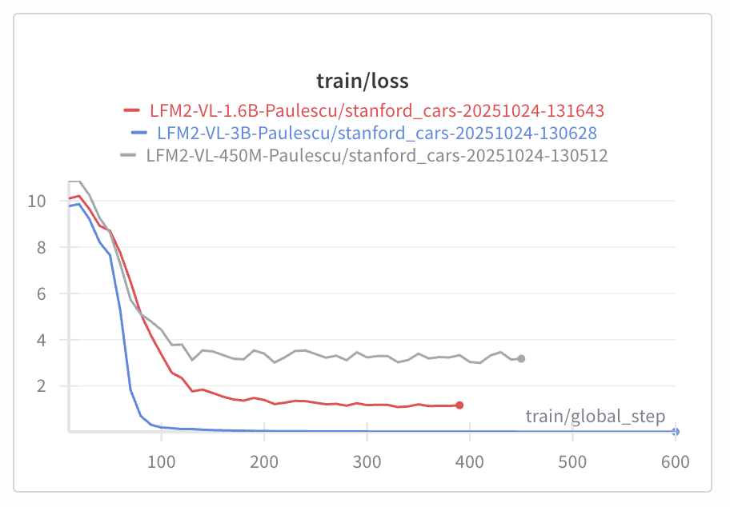
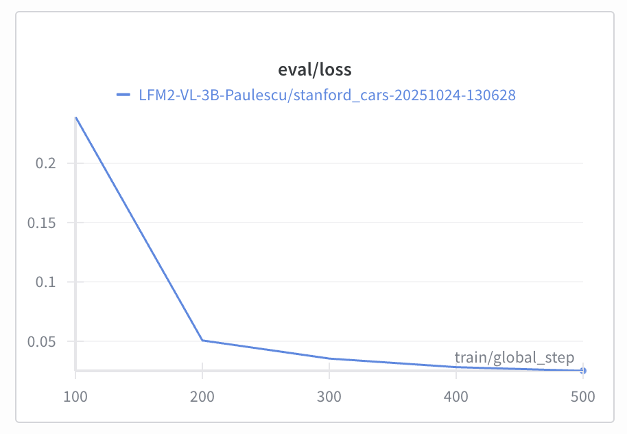

# Fine-tuning LFM2-VL-3B to identify car makers

Today is Part 4 of my hands-on tutorial on fine-tuning Visual Language Models for image classification tasks.

If you missed Parts 1, 2 or 3, you can find them here:
- Part 1: [Problem framing and baseline accuracy for cats-vs-dogs](https://paulabartabajo.substack.com/p/lets-build-an-image-classification)

- Part 2: [How to get JSON out of a Visual Language Model](https://paulabartabajo.substack.com/p/how-to-get-json-out-of-a-visual-language)

- Part 3: [Fine-tuning LFM2-VL-450M to achieve 100% accuracy on the cats-vs-dogs classification task](https://paulabartabajo.substack.com/p/lets-fine-tune-a-small-vision-model)

So far we have built a perfect classifier for cats vs dogs classification.

And look, it feels great getting a 100% accuracy on the eval dataset, but a cats-vs-dogs classifier still feels like a bit to easy.

Today, we will take one step further, and work with a problem which is closer to a real-world use case.

We will build a classifier for car makers:


We will be using the LFM2-VL-450M and LFM2-VL-1.6B models, as well as the newly released LFM2-VL-3B model.

Let's start!

You can find all the source code in this open-source repository.
Give it a star on Github ⭐ if you get value from it
Go to the code

## Step 1. Generating the trainining and evaluation datasets

I went to Hugging Face Hub  and found [this dataset](https://huggingface.co/datasets/tanganke/stanford_cars) of car images with their full names, that includes the car maker, model and year. There are around 8k samples and 196 classes, which means that on average there are 40 samples per class.

After playing a bit with the dataset, I realized that having 40 samples per class was not enough to fine-tune a good model, so I decided to simplify a bit the task and only keep the car maker.

I will try to get back to the original maker-model-year classification problem in a future newsletter, and do some data engineering to get more samples per class.

You can fully reproduce the dataset generation process by running the following command:
```sh
$ uv run python scripts/generate_cars_dataset.py
```

The final dataset I created is on Hugging Face. You can find it [here](https://huggingface.co/datasets/Paulescu/stanford_cars).

The dataset has almost 7k images in the train split and 7k more in the test split. The target class we wil try to predict (the car maker) is a categorical value with 49 possible values. This means that, on average, each car maker has around 140 samples in the dataset. Not bad.


## Step 2. Establishing a baseline accuracy

Before we start fine-tuning, we need to establish a baseline accuracy.

I decided to use 3 different models to establish a baseline accuracy:

- [LFM2-VL-450M](https://leap.liquid.ai/models?model=lfm2-vl-450m)
- [LFM2-VL-1.6B](https://leap.liquid.ai/models?model=lfm2-vl-1.6b)
- [LFM2-VL-3B](https://leap.liquid.ai/models?model=lfm2-vl-3b)

For each model we used the same system and user prompts:
```yaml
system_prompt: |
  You excel at identifying car makers from pictures.

user_prompt: |
  What car maker do you see in this picture?
  Pick one from the following list:

  - AM
  - Acura
  - Aston
  - Audi
 ...
  - Toyota
  - Volkswagen
  - Volvo
  - smart
```

### Results

You can replicate the evaluation runs by running the following commands:

```sh
# LFM2-VL-450M
$ make evaluate CONFIG_FILE=stanford_cars_v0.yaml

# LFM2-VL-1.6B
$ make evaluate CONFIG_FILE=stanford_cars_v1.yaml

# LFM2-VL-3B
$ make evaluate CONFIG_FILE=stanford_cars_v2.yaml
```

You get the following results:

| Model | Accuracy |
|-------|----------|
| LFM2-VL-450M | 60% |
| LFM2-VL-1.6B | 72% |
| LFM2-VL-3B | 80% |

Not bad. But honestly, we can do better. Otherwise I would not be sitting in front of the laptop late Friday night writing all this.


## Step 3. Fine-tuning the models to squeeze all the juice

As we did last week with the cats-vs-dogs task, we will fine-tune the models to squeeze all the juice out of them.

We will us LoRA to reduce the number of parameters we need to train, and speed things up, without sacrificing too much accuracy (that is the magic of LoRA).

We run 3 experiments, one for each model, and logged all results in Weights and Biases.

You can replicate these experiments by running the following commands:

```sh
# LFM2-VL-450M
$ make fine-tune CONFIG_FILE=finetune_cars_v0.yaml

# LFM2-VL-1.6B
$ make fine-tune CONFIG_FILE=finetune_cars_v1.yaml

# LFM2-VL-3B
$ make fine-tune CONFIG_FILE=finetune_cars_v2.yaml
```

Looking at the training loss curve we see the 3 curves saturate at very different levels, sorted by size from LFM2-VL-450M to LFM2-VL-3B, with LFM2-VL-3B reaching the lowest loss.



At this point, I will proceed only with the LFM2-VL-3B model, as it seems to be the best performing one.

Attention!

Don't be fooled by the training loss curve.
The fact that the training loss approaches 0.0 does NOT MEAN we are done.
Language Models are highly parameterized neural networks, and these guys can fit anything on the training set, but terribly perform on the evaluation set.

So, the next thing to look is the evaluation loss curve of the LFM2-VL-3B model.



This curve is decreasing, meaning the model is learning something and not just memorizing the training set (aka overfitting). That's good news!

But hey, we are not done yet. We need to run again the evaluation loop we used in the beginning of this tutorial, to see if the fine-tuned model is actually better than the original model.

## Step 4. Evaluating the fine-tuned model

During the fine-tuning process, I saved model checkpoints every 100 steps, so I could run evaluations on intermediate checkpoints to better understand the model's performance at different stages of the training process.


### Results

You can replicate the evaluation runs by running the following commands:

```sh
# LFM2-VL-3B checkpoint-100
$ make evaluate CONFIG_FILE=stanford_cars_checkpoint_100.yaml

# LFM2-VL-3B checkpoint-200
$ make evaluate CONFIG_FILE=stanford_cars_checkpoint_200.yaml

# LFM2-VL-3B checkpoint-300
$ make evaluate CONFIG_FILE=stanford_cars_checkpoint_300.yaml

# LFM2-VL-3B checkpoint-400
$ make evaluate CONFIG_FILE=stanford_cars_checkpoint_400.yaml

# LFM2-VL-3B checkpoint-400
$ make evaluate CONFIG_FILE=stanford_cars_checkpoint_500.yaml
```

And the results are:

| Model | Accuracy |
|-------|----------|
| LFM2-VL-3B (without fine-tuning) | 80% |
| LFM2-VL-3B (checkpoint-100) | 52% |
| LFM2-VL-3B (checkpoint-200) | 84% |
| LFM2-VL-3B (checkpoint-300) | 84% |
| LFM2-VL-3B (checkpoint-400) | 84% |
| LFM2-VL-3B (checkpoint-500) | 86% |

Observations:

- The accuracy after 100 steps is way worse (52%) than the original model (80%). Why? Because the LoRA parameters we introduced are not yet adjusted well enough, and they just add noise to the final model, decreasing its accuracy.

- After 200 steps, the models are already better than the original model, and the accuracy starts decreasing slowly.

I did not have time to run the fine-tuning further than 500 steps, but I invite you to do it yourself.

My intuition is that the accuracy will continue to decrease, but at a slower rate, and eventually plateau around 90%.

Which is both good and bad news.

- Good news -> identify the correct car maker out of 49 possible values 90% of the time is not that bad for today.

- Bad news -> a 90% accuracy classifier is not something you can sell to your boss or client. They want something better. They want a 100% accuracy classifier.

## What's next?

Next week I will continue the training process, to confirm this hypothesis and (if I have time) I will try to do some data engineering to get more samples per class and improve the model's accuracy.

Wish you all a great weekend!

Peace and love!

Pau